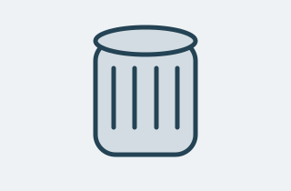

<div align="center">

**МИНИСТЕРСТВО НАУКИ И ВЫСШЕГО ОБРАЗОВАНИЯ РОССИЙСКОЙ ФЕДЕРАЦИИ**  
**ФГБОУ ВО «УФИМСКИЙ УНИВЕРСИТЕТ НАУКИ И ТЕХНОЛОГИЙ»**

<br><br>

**Кафедра АСУ**

<br><br><br>

# ОТЧЁТ
## по лабораторной работе № 1
### по дисциплине «Веб-программирование»

<br><br><br><br>

</div>

**Тема:** статическая клиентская часть веб-приложения «Каталог автозапчастей»  

**Выполнил:** студент группы ИВТ-ИСУ-302Б  
**Фамилия И.О.:** Валиахметов Р.А.
**Проверил:** Аитбаев Вадим Салимьянович
<br><br><br><br>

<div align="center">

**г. Уфа 2026**

</div>

---

# 1. Цель работы

Создать статическую клиентскую часть веб-приложения на тему «Каталог автозапчастей», используя HTML и CSS. В работе необходимо было сформировать семантическую структуру страницы, разместить коллекцию однотипных объектов, добавить форму поиска или фильтрации, применить CSS Grid и Flexbox, а также обеспечить корректное отображение сайта на разных размерах экрана.

# 2. Постановка задачи

В соответствии с заданием требовалось разработать главную страницу будущего веб-приложения. Страница должна содержать:

- шапку с названием проекта и навигацией;
- главный заголовок и описание назначения сайта;
- минимум шесть карточек однотипных объектов;
- изображение для каждой карточки;
- название, описание и характеристики каждой запчасти;
- форму поиска или фильтрации с двумя разными полями;
- дополнительный информационный блок;
- подвал с названием проекта;
- отдельный HTML-файл и отдельный CSS-файл;
- адаптивную сетку для мобильного, планшетного и широкого экрана.

В рамках первой лабораторной работа формы и загрузка данных с сервера не требовались. Поэтому карточки были размещены непосредственно в HTML, а сервер, JavaScript и база данных не использовались.

# 3. Выбор темы и назначение приложения

В качестве темы выбран каталог автозапчастей «АвтоДеталь». Приложение предназначено для просмотра учебной коллекции деталей автомобиля и их основных характеристик. Пользователь может ознакомиться с назначением запчасти, её категорией, артикулом и техническим параметром.

В каталоге размещены следующие объекты:

1. масляный фильтр;
2. тормозной диск;
3. свеча зажигания;
4. воздушный фильтр;
5. амортизатор;
6. поликлиновой ремень.

Артикулы и цены являются учебными и не используются для реальной продажи. Это позволяет показать структуру будущего каталога без подключения базы данных.

# 4. Структура проекта

Проект организован следующим образом:

```text
auto-parts/
├── index.html
├── styles/
│   └── main.css
├── assets/
│   └── images/
│       ├── air.svg
│       ├── belt.svg
│       ├── brake.svg
│       ├── filter.svg
│       ├── plug.svg
│       └── shock.svg
└── README.md
```

Файл `index.html` содержит структуру и содержимое страницы.  
Файл `styles/main.css` содержит оформление и адаптивные правила.  
Папка `assets/images` содержит шесть локальных SVG-изображений.  
Файл `README.md` содержит описание проекта, способ запуска и пояснения для защиты.

# 5. Структура HTML-документа

В начале файла расположен обязательный тип документа:

```html
<!doctype html>
```

Он сообщает браузеру, что документ написан по стандарту HTML5.

Корневой элемент страницы задан так:

```html
<html lang="ru">
```

Атрибут `lang="ru"` указывает русский язык документа.

Внутри элемента `head` размещены служебные данные:

```html
<meta charset="utf-8">
<meta name="viewport" content="width=device-width, initial-scale=1">
<title>АвтоДеталь — каталог автозапчастей</title>
<link rel="stylesheet" href="styles/main.css">
```

`meta charset` устанавливает кодировку UTF-8. Это необходимо для корректного отображения русских символов. Метатег `viewport` обеспечивает правильный масштаб на мобильных устройствах. Элемент `title` задаёт название вкладки браузера. Элемент `link` подключает внешний файл CSS.

Видимое содержимое страницы находится внутри `body`. Для структуры используются семантические элементы:

- `header` — шапка сайта;
- `nav` — навигация;
- `main` — основное содержимое;
- `section` — отдельные смысловые разделы;
- `article` — самостоятельная карточка запчасти;
- `footer` — подвал страницы.

Такое разделение делает структуру документа понятной и упрощает дальнейшее развитие проекта.

# 6. Шапка и навигация

Шапка сайта создана с помощью элемента `header`:

```html
<header class="site-header">
  <div class="container header-inner">
    <a class="brand" href="index.html">
      Авто<span>Деталь</span>
    </a>
    <nav aria-label="Основная навигация">
      <a href="#catalog">Каталог</a>
      <a href="#guide">Как подобрать</a>
      <a href="#about">О проекте</a>
    </nav>
  </div>
</header>
```

Название проекта сделано ссылкой, поэтому при нажатии пользователь возвращается к файлу `index.html`. Навигационные ссылки используют фрагменты URL: `#catalog`, `#guide` и `#about`. Они ведут к соответствующим разделам текущей страницы.

Атрибут `class` связывает HTML-элементы с правилами CSS. Например, класс `site-header` связан с CSS-правилом оформления шапки.

# 7. Главный экран

Главный экран содержит небольшой дополнительный текст, главный заголовок, описание и ссылку-переход к каталогу:

```html
<section class="hero">
  <p class="eyebrow">ДЕТАЛИ, КОТОРЫЕ ВАЖНЫ</p>
  <h1>Каталог<br>автозапчастей<span>.</span></h1>
  <p>Изучайте назначение деталей, сравнивайте характеристики и находите нужную категорию в одном каталоге.</p>
  <a class="button" href="#catalog">Посмотреть запчасти</a>
</section>
```

Заголовок первого уровня `h1` используется только для главного названия страницы. Тег `br` переносит часть заголовка на новую строку. Ссылка с классом `button` оформлена средствами CSS как кнопка, но остаётся ссылкой, потому что её задача — перейти к другому разделу страницы.

# 8. Форма подбора запчастей

Форма расположена в отдельном разделе:

```html
<form action="index.html#catalog" method="get">
  <label for="query">Название или артикул</label>
  <input id="query" name="query" type="search">

  <label for="category">Категория</label>
  <select id="category" name="category">
    <option value="all">Все категории</option>
    <option value="engine">Двигатель</option>
    <option value="brakes">Тормоза</option>
  </select>

  <button type="submit">Найти</button>
</form>
```

В форме используются два поля разных типов:

- `input type="search"` — текстовое поле поиска по названию или артикулу;
- `select` — выпадающий список категорий.

Каждое поле имеет собственный `label`. Связь между подписью и полем задаётся одинаковыми значениями `for` и `id`. Атрибут `name` нужен для формирования параметров при отправке формы.

Метод `get` добавляет введённые данные в адрес страницы. В первой лабораторной настоящая фильтрация не требовалась, поэтому форма демонстрирует интерфейс и отправку параметров, а не изменяет список карточек. Реальную фильтрацию можно реализовать на следующем этапе с помощью JavaScript или серверной части.

# 9. Карточки автозапчастей

Карточки размещены внутри контейнера:

```html
<div class="cards">
  <article class="card">
    
    <div class="card-body">
      <p class="category">Фильтрация масла</p>
      <h3>Масляный фильтр</h3>
      <p class="description">Задерживает загрязнения в системе смазки двигателя.</p>
      <dl>
        <div><dt>Артикул</dt><dd>AP-FL-001</dd></div>
        <div><dt>Категория</dt><dd>Двигатель</dd></div>
        <div><dt>Параметр</dt><dd>Резьба M20 × 1,5</dd></div>
      </dl>
      <p class="price">490 ₽</p>
    </div>
  </article>
</div>
```

Каждая карточка является элементом `article`, потому что представляет самостоятельный объект каталога.

Изображение подключается элементом `img`. Атрибут `src` содержит путь к локальному SVG-файлу, а `alt` описывает изображение для случаев, когда оно не загрузилось или используется программа экранного доступа.

В карточках проекта содержатся три характеристики:

- артикул;
- категория;
- технический параметр.

Помимо названия и описания, карточки отличаются данными и изображениями. Это позволяет пользователю понять, что каталог содержит разные типы автозапчастей.

# 10. Информационные блоки

После каталога размещён раздел «Как подобрать деталь». Он содержит три последовательных шага:

1. уточнить марку, модель, год выпуска и двигатель;
2. сверить номер детали;
3. проверить применяемость по VIN.

Этот блок является дополнительной полезной информацией, предусмотренной заданием лабораторной работы.

Также добавлен раздел «О проекте». В нём объясняется назначение каталога и указано, что цены и артикулы являются учебными.

# 11. Подвал страницы

Подвал реализован с помощью элемента `footer`. В нём указаны:

- название проекта;
- год создания;
- номер лабораторной работы;
- ссылка для возврата к началу страницы.

Подвал завершает структуру главной страницы и содержит дополнительную служебную информацию.

# 12. Использование CSS

Стили размещены в отдельном файле `styles/main.css`. Это разделяет содержимое и оформление: HTML отвечает за структуру, а CSS — за внешний вид.

В CSS заданы следующие основные параметры:

```css
body {
  margin: 0;
  background: #f5f7f8;
  color: #172f3c;
  font-family: Arial, Helvetica, sans-serif;
}
```

`margin: 0` убирает стандартный отступ браузера. `background` задаёт цвет фона. `color` определяет основной цвет текста. `font-family` задаёт семейство шрифтов.

Для ограничения ширины содержимого применяется класс `container`. Благодаря этому текст и карточки не растягиваются на всю ширину большого экрана.

Карточки оформлены белым фоном, рамкой, скруглением углов и внутренними отступами. Изображения занимают ширину карточки и не выходят за её границы.

# 13. CSS Grid

Для каталога применяется CSS Grid:

```css
.cards {
  display: grid;
  grid-template-columns: 1fr;
  gap: 22px;
}
```

Свойство `display: grid` включает сеточную модель. `grid-template-columns` определяет количество колонок. `gap` задаёт расстояние между карточками.

С помощью медиазапросов число колонок меняется:

```css
@media (min-width: 640px) {
  .cards {
    grid-template-columns: repeat(2, 1fr);
  }
}

@media (min-width: 1024px) {
  .cards {
    grid-template-columns: repeat(3, 1fr);
  }
}
```

На узком экране карточки идут в одну колонку. На планшете они размещаются в две колонки. На широком экране используется три колонки.

Grid выбран для каталога, потому что карточки образуют двумерную структуру из строк и колонок.

# 14. Flexbox

Flexbox используется для элементов, которые располагаются преимущественно в одном направлении.

Пример для шапки:

```css
.header-inner {
  display: flex;
  align-items: center;
  justify-content: space-between;
  gap: 24px;
}
```

Логотип и навигация располагаются в одну строку. `justify-content: space-between` раздвигает их по краям контейнера.

Flexbox также используется:

- в навигации;
- в форме поиска;
- в подвале;
- в строках характеристик карточек.

# 15. Адаптивность

Адаптивность обеспечена медиазапросами `@media`. Страница рассчитана на проверку при ширине окна 360, 768 и 1280 пикселей.

При ширине 360 пикселей:

- используется одна колонка карточек;
- кнопка формы занимает всю доступную ширину;
- уменьшаются внутренние отступы;
- навигация может переноситься на новую строку.

При ширине 768 пикселей используются две колонки. При ширине 1280 пикселей используются три колонки.

Изображения ограничены правилом `max-width: 100%`, поэтому они не выходят за границы карточек и не создают горизонтальную прокрутку.

# 16. Доступность и удобство использования

Для изображений заданы содержательные значения `alt`. У полей формы есть видимые подписи `label`. Навигация выполнена обычными ссылками, а отправка формы — настоящей кнопкой.

Для интерактивных элементов задано состояние фокуса:

```css
button:focus-visible,
input:focus-visible,
select:focus-visible,
a:focus-visible {
  outline: 3px solid #1867a0;
}
```

Это позволяет пользователю видеть активный элемент при перемещении клавишей Tab.

# 17. Проверка результата

В ходе проверки проекта были выполнены следующие действия:

1. Проверено наличие `<!doctype html>`, языка страницы, кодировки, viewport и заголовка вкладки.
2. Проверено наличие семантических элементов `header`, `nav`, `main`, `section`, `article` и `footer`.
3. Проверено наличие шести карточек.
4. Проверено наличие формы с поисковым полем, списком категорий и кнопкой.
5. Проверены локальные пути к шести SVG-изображениям.
6. Проверено подключение отдельного CSS-файла.
7. Проверено использование Grid и Flexbox.
8. Проверены медиазапросы для разных размеров экрана.
9. Проверено наличие видимого фокуса интерактивных элементов.
10. Проверено отсутствие ссылок с пустым `href="#"`.


# 18. Вывод

В ходе лабораторной работы была создана статическая клиентская часть веб-приложения «АвтоДеталь». Разработана семантическая HTML-структура, добавлены шесть карточек автозапчастей с изображениями и характеристиками, форма подбора, навигация, информационные разделы и подвал.

Оформление вынесено в отдельный CSS-файл. Для каталога применён CSS Grid, для навигации, формы и служебных блоков — Flexbox. С помощью медиазапросов реализована адаптивная версия для мобильных, планшетных и широких экранов. Получившаяся структура может использоваться как основа для последующего подключения JavaScript, сервера и базы данных.
